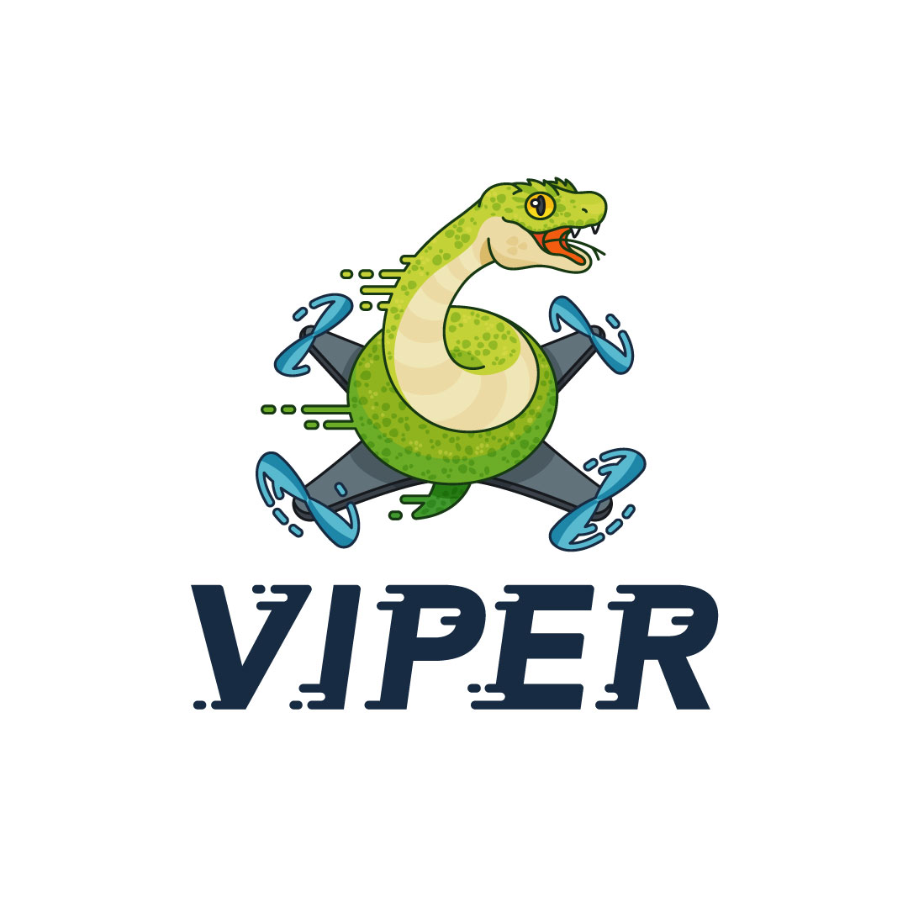

`107-Arduino-UAVCAN`
====================
[](https://github.com/107-systems/107-Arduino-UAVCAN/actions?workflow=Unit+Tests)
[](https://codecov.io/gh/107-systems/107-Arduino-UAVCAN)
[](https://github.com/107-systems/107-Arduino-UAVCAN/actions?workflow=Compile+Examples)
[](https://github.com/107-systems/107-Arduino-UAVCAN/actions?workflow=Extra+Library+Checks)
[](https://github.com/107-systems/107-Arduino-UAVCAN/actions?workflow=General+Formatting+Checks)
[](https://github.com/107-systems/107-Arduino-UAVCAN/actions?workflow=Spell+Check)

<p align="center">
  <a href="https://github.com/107-systems/107-Arduino-Viper"></a>
</p>

Arduino library for providing a convenient C++ interface for accessing [UAVCAN](https://uavcan.org/) utilizing [libcanard](https://github.com/UAVCAN/libcanard).

## Example
### Subscribe
```C++
#include <ArduinoUAVCAN.h>
#include <types/uavcan/node/Heartbeat.1.0.h>
/* ... */
ArduinoUAVCAN uavcan(13, micros, nullptr);
/* ... */
void setup() {
  /* ... */
  uavcan.subscribe<Heartbeat_1_0>(onHeatbeat_1_0_Received);
}
/* ... */
void onHeatbeat_1_0_Received(CanardTransfer const & transfer, ArduinoUAVCAN & /* uavcan */)
{
  Heartbeat_1_0 const hb = Heartbeat_1_0::create(transfer);

  char msg[64];
  snprintf(msg, 64, "ID %02X, Uptime = %d, Health = %d, Mode = %d, VSSC = %d", transfer.remote_node_id, hb.uptime(), (int)hb.health(), (int)hb.mode(), hb.vssc());

  Serial.println(msg);
}
```

### Publish
```C++
#include <ArduinoUAVCAN.h>
#include <types/uavcan/node/Heartbeat.1.0.h>
/* ... */
ArduinoUAVCAN uavcan(13, micros, nullptr);
Heartbeat_1_0 hb(0, Heartbeat_1_0::Health::NOMINAL, Heartbeat_1_0::Mode::INITIALIZATION, 0);
/* ... */
void setup() {
  /* ... */
  uavcan.subscribe<Heartbeat_1_0>(onHeatbeat_1_0_Received);
}

void loop() {
  /* Update the heartbeat object */
  hb.uptime(millis() / 1000);
  hb.mode(Heartbeat_1_0::Mode::OPERATIONAL);

  /* Publish the heartbeat once/second */
  static unsigned long prev = 0;
  unsigned long const now = millis();
  if(now - prev > 1000) {
    uavcan.publish(hb);
    prev = now;
  }

  /* Transmit all enqeued CAN frames */
  while(uavcan.transmitCanFrame()) { }
}
```

### Service Client
```C++
#include <ArduinoUAVCAN.h>
#include <types/uavcan/node/ExecuteCommand.1.0.h>
/* ... */
ArduinoUAVCAN uavcan(13, micros, nullptr);
/* ... */
void setup() {
  /* ... */
  /* Request some coffee. */
  char const cmd_param[] = "I want a double espresso with cream";
  ExecuteCommand_1_0::Request req(0xCAFE, reinterpret_cast<uint8_t const *>(cmd_param), sizeof(cmd_param));
  uavcan.request<ExecuteCommand_1_0::Request, ExecuteCommand_1_0::Response>(req, 27 /* remote node id */, onExecuteCommand_1_0_Response_Received);
}

void loop() {
  /* Transmit all enqeued CAN frames */
  while(uavcan.transmitCanFrame()) { }
}
/* ... */
void onExecuteCommand_1_0_Response_Received(CanardTransfer const & transfer, ArduinoUAVCAN & /* uavcan */) {
  ExecuteCommand_1_0::Response const rsp = ExecuteCommand_1_0::Response::create(transfer);

  if (rsp.status() == ExecuteCommand_1_0::Response::Status::SUCCESS)
    Serial.println("Coffee successful retrieved");
  else
    Serial.println("Error when retrieving coffee");
}
```


### Service Server
```C++
#include <ArduinoUAVCAN.h>
#include <types/uavcan/node/ExecuteCommand.1.0.h>
/* ... */
ArduinoUAVCAN uavcan(13, micros, nullptr);
/* ... */
void setup() {
  /* ... */
  /* Subscribe to incoming service requests */
  uavcan.subscribe<ExecuteCommand_1_0::Request>(onExecuteCommand_1_0_Request_Received);
}

void loop() {
  /* Transmit all enqeued CAN frames */
  while(uavcan.transmitCanFrame()) { }
}
/* ... */
void onExecuteCommand_1_0_Request_Received(CanardTransfer const & transfer, ArduinoUAVCAN & uavcan) {
  ExecuteCommand_1_0::Request req = ExecuteCommand_1_0::Request::create(transfer);

  if (req.command() == 0xCAFE) {
    ExecuteCommand_1_0::Response rsp(ExecuteCommand_1_0::Response::Status::SUCCESS);
    uavcan.respond(rsp, transfer.remote_node_id, transfer.transfer_id);
  } else {
    ExecuteCommand_1_0::Response rsp(ExecuteCommand_1_0::Response::Status::NOT_AUTHORIZED);
    uavcan.respond(rsp, transfer.remote_node_id, transfer.transfer_id);
  }
}
```
