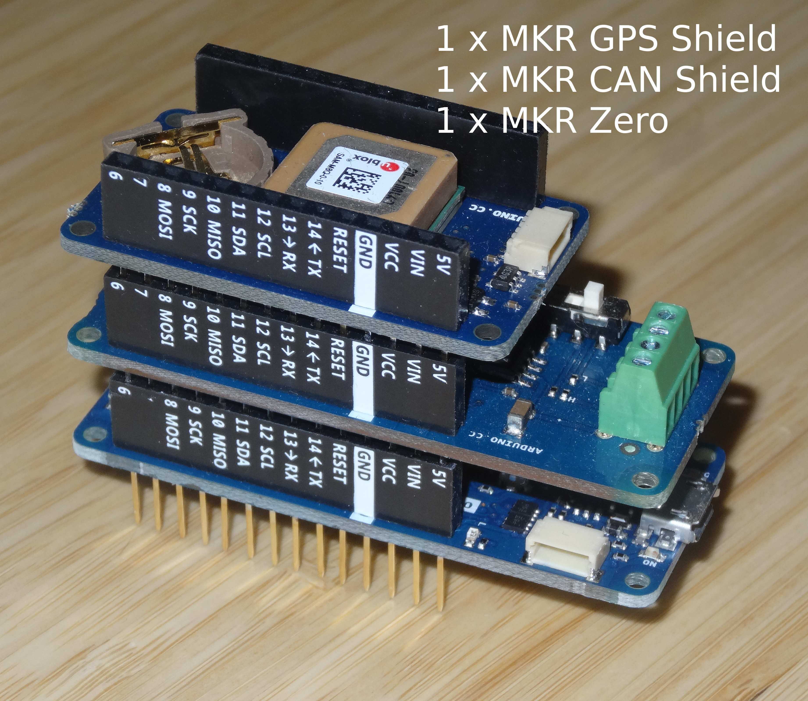

UAVCAN-GNSS-Node
================
Demo firmware for UAVCAN GNSS Node utilizing 107-Arduino-UAVCAN.

**Attention**: [`107-Arduino-UAVCAN`](https://github.com/107-systems/107-Arduino-UAVCAN) (which provides the UAVCAN connectivity within this demo sketch) is supporting [UAVCAN](https://uavcan.org/) ([v1.0-beta](https://uavcan.org/specification/UAVCAN_Specification_v1.0-beta.pdf)). Most UAVCAN support tools do not yet support UAVCAN V1 (but legacy UAVCAN V0). Therefore the best way to interact with the UAVCAN GNSS Node is via [`pyuavcan`](https://github.com/UAVCAN/pyuavcan) which has already been ported to V1.

### Hardware Setup
In order to assemble the hardware required for the `UAVCAN-GNSS-Node` you need to integrate a [`MKR Zero`](https://store.arduino.cc/mkr-zero) with a [`MKR CAN Shield`](https://store.arduino.cc/arduino-mkr-can-shield) and a [`MKR GPS Shield`](https://store.arduino.cc/arduino-mkr-gps-shield) as shown below.

  

