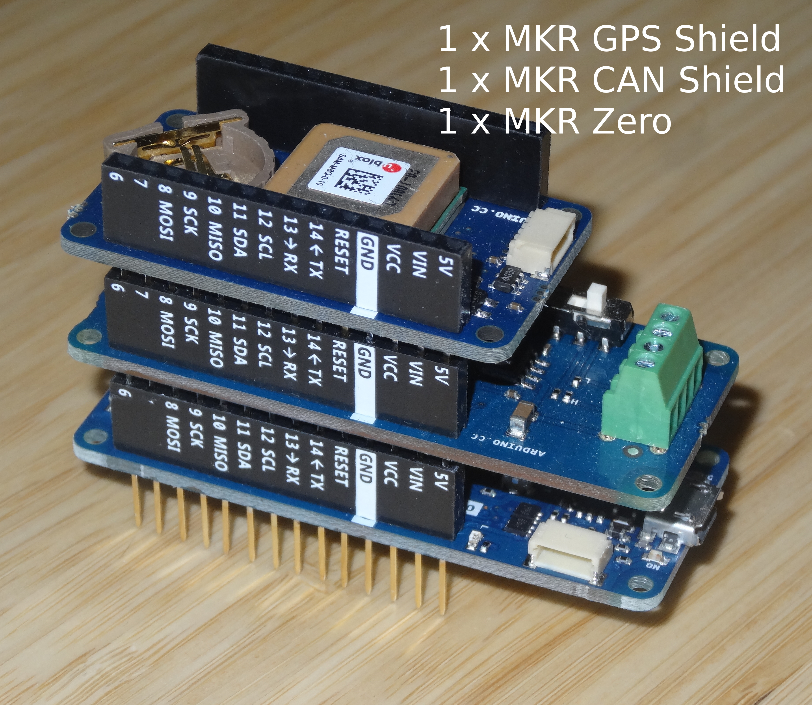

<a href="https://opencyphal.org/"></
`OpenCyphal-GNSS-Node`
==================
Demo firmware for OpenCyphal GNSS Node utilizing [107-Arduino-OpenCyphal](https://github.com/107-systems/107-Arduino-OpenCyphal).

**Attention**: [107-Arduino-OpenCyphal](https://github.com/107-systems/107-Arduino-OpenCyphal) (which provides the OpenCyphal connectivity within this demo sketch) is supporting [OpenCyphal](https://opencyphal.org/) ([v1.0-beta](https://opencyphal.org/specification/OpenCyphal_Specification_v1.0-beta.pdf)). Most OpenCyphal support tools do not yet support OpenCyphal V1 (but legacy OpenCyphal V0). Therefore the best way to interact with the OpenCyphal GNSS Node is via [pyopencyphal](https://github.com/OpenCyphal/pyopencyphal) which has already been ported to V1.

### Hardware Setup
In order to assemble the hardware required for the `OpenCyphal-GNSS-Node` you need to integrate a [`MKR Zero`](https://store.arduino.cc/mkr-zero) with a [`MKR CAN Shield`](https://store.arduino.cc/arduino-mkr-can-shield) and a [`MKR GPS Shield`](https://store.arduino.cc/arduino-mkr-gps-shield) as shown below.

<p align="center">
  
</p>

### Quick Start
* Install [arduino-cli](https://arduino.github.io/arduino-cli/latest/installation)
* [Compile](https://arduino.github.io/arduino-cli/latest/commands/arduino-cli_compile/):
```bash
arduino-cli compile -b arduino:samd:mkrzero
```
* Connect your MKR Zero based Arduino stack and [upload](https://arduino.github.io/arduino-cli/latest/commands/arduino-cli_upload/):
```bash
arduino-cli upload .
```
* Or compile and upload in one step:
```bash
arduino-cli compile -b arduino:samd:mkrzero -u
```
