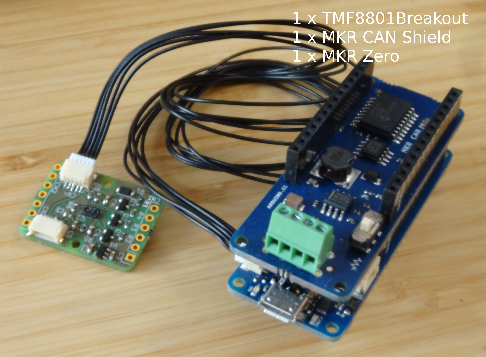
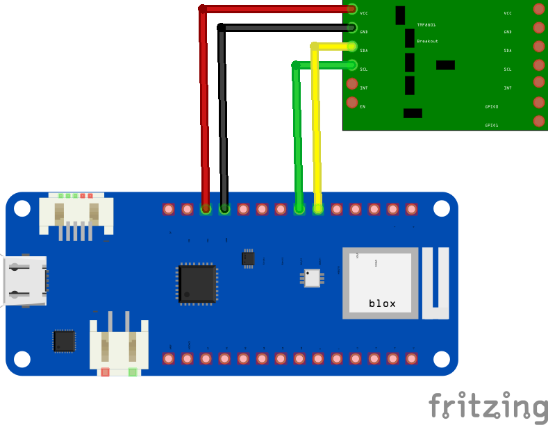

<a href="https://opencyphal.org/"></a>

`OpenCyphal-ToF-Distance-Sensor-Node`
====================================
Demo firmware for OpenCyphal ToF Distance Sensor Node utilizing [107-Arduino-Cyphal](https://github.com/107-systems/107-Arduino-Cyphal).

### Hardware Setup
In order to assemble the hardware required for the `OpenCyphal-ToF-Distance-Sensor-Node` you need to integrate a [`MKR Zero`](https://store.arduino.cc/mkr-zero) with a [`MKR CAN Shield`](https://store.arduino.cc/arduino-mkr-can-shield) and a [`TMF8801Breakout`](https://github.com/generationmake/TMF8801Breakout) as shown below.

<p align="center">
  
</p>

<p align="center">
  
</p>

The MKR CAN Shield is not pictured. It is simply stacked on top of the MKR Zero.

### Quick Start
* Install [arduino-cli](https://arduino.github.io/arduino-cli/latest/installation)
* [Compile](https://arduino.github.io/arduino-cli/latest/commands/arduino-cli_compile/):
```bash
arduino-cli compile -b arduino:samd:mkrzero
```
* Connect your MKR Zero based Arduino stack and [upload](https://arduino.github.io/arduino-cli/latest/commands/arduino-cli_upload/):
```bash
arduino-cli upload .
```
* Or compile and upload in one step:
```bash
arduino-cli compile -b arduino:samd:mkrzero -u -p /dev/ttyACM0
```
**Note**: By adding argument `--build-property compiler.cpp.extra_flags="-DCYPHAL_NODE_INFO_GIT_VERSION=0x$(git describe --always)"` you can feed the Git hash of the current software version to [107-Arduino-Cyphal](https://github.com/107-systems/107-Arduino-Cyphal) stack from where it can be retrieved via i.e. [yakut](https://github.com/opencyphal/yakut).
