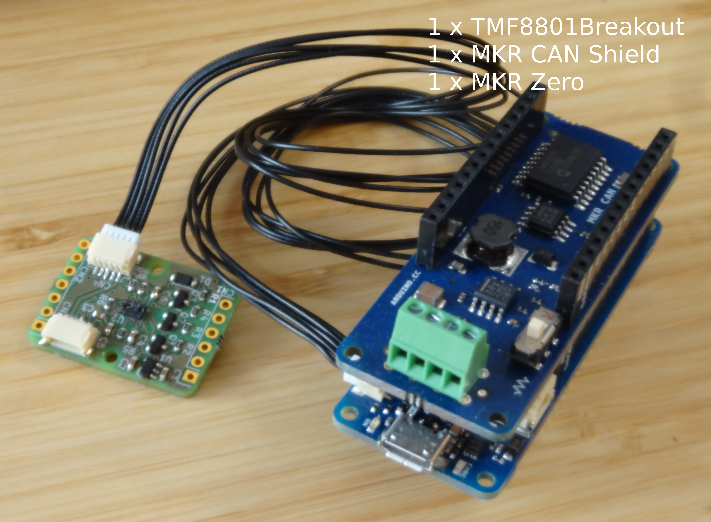
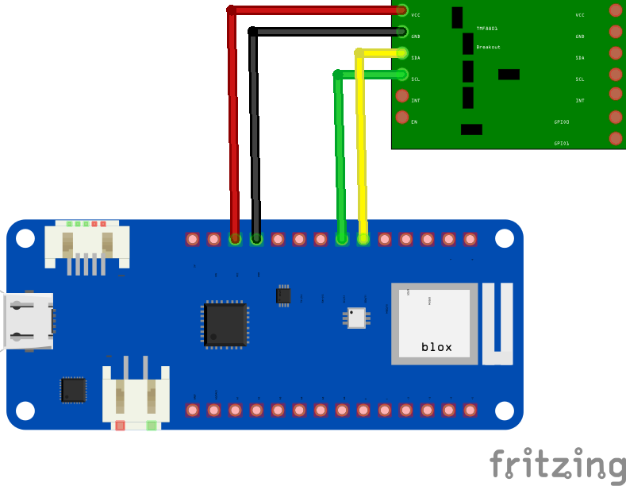

<a href="https://uavcan.org/"></a>
UAVCAN-ToF-Distance-Sensor-Node
===============================
Demo firmware for UAVCAN ToF Distance Sensor Node utilizing [107-Arduino-UAVCAN](https://github.com/107-systems/107-Arduino-UAVCAN).

### Hardware Setup
In order to assemble the hardware required for the `UAVCAN-ToF-Distance-Sensor-Node` you need to integrate a [`MKR Zero`](https://store.arduino.cc/mkr-zero) with a [`MKR CAN Shield`](https://store.arduino.cc/arduino-mkr-can-shield) and a [`TMF8801Breakout`](https://github.com/generationmake/TMF8801Breakout) as shown below.

<p align="center">
  
</p>

<p align="center">
  
</p>

The MKR CAN Shield is not pictured. It is simply stacked on top of the MKR Zero.

### Quick Start
* Install [arduino-cli](https://arduino.github.io/arduino-cli/latest/installation)
* Clone this repository and [compile](https://arduino.github.io/arduino-cli/latest/commands/arduino-cli_compile/):
```bash
git clone https://github.com/107-systems/UAVCAN-ToF-Distance-Sensor-Node && cd UAVCAN-ToF-Distance-Sensor-Node
arduino-cli compile -b arduino:samd:mkrzero
```
* Connect your MKR Zero based Arduino stack and [upload](https://arduino.github.io/arduino-cli/latest/commands/arduino-cli_upload/):
```bash
arduino-cli upload .
```
* Or compile and upload in one step:
```bash
arduino-cli compile -b arduino:samd:mkrzero -u
